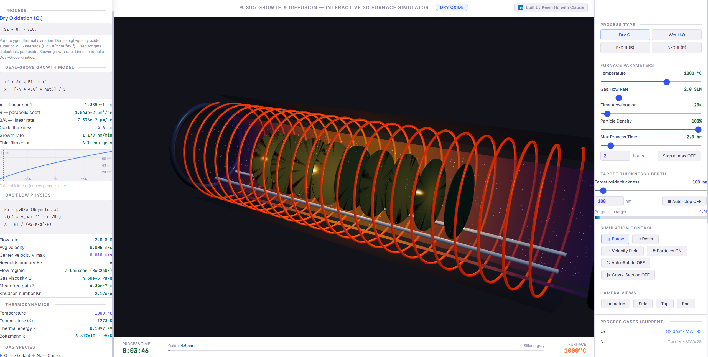

# SiO₂ Growth & Diffusion — Interactive 3D Furnace Simulator

An interactive, browser-based 3D simulation of a semiconductor thermal furnace. Visualises silicon dioxide (SiO₂) oxidation and dopant diffusion in real time, using physically accurate models (Deal-Grove, Fick's 2nd Law, Hagen-Poiseuille flow).

**Built by [Kevin Ho](https://www.linkedin.com/in/chihkuan-ho/) with Claude**

---

## Screenshots

### Dry Oxidation — Isometric View


---

## Live Demo

Open `index.html` directly in any modern browser — no server, no install, no dependencies required.

---

## Features

| Feature | Details |
|---|---|
| 4 process modes | Dry O₂, Wet H₂O oxidation · P-Type (Boron) & N-Type (Phosphorus) diffusion |
| 3D furnace model | Rotating quartz tube, heating coil, wafer boat with 9 silicon wafers |
| Real-time gas flow | 1 000 particle system with parabolic (Hagen-Poiseuille) velocity profile |
| Velocity field overlay | 4 cross-section planes showing laminar flow arrows |
| Oxide colour | Thin-film interference colours (HSL-interpolated, smooth transitions) |
| Live charts | Oxide thickness vs time **and** junction depth vs time with time cursor |
| Concentration profile | log₁₀ C(x,t) vs depth with xⱼ cursor and axis scales |
| Hover tooltip | Click/hover any wafer for live thickness, growth rate, junction depth |
| Target & auto-stop | Set a target thickness or junction depth; simulation pauses on arrival |
| Camera controls | Orbit, zoom, pan · preset views: Isometric, Side, Top, End |
| Cross-section view | Slices the tube to reveal the interior |

---

## How to Run

1. Clone or download the repository
2. Open **`index.html`** in Chrome, Firefox, Edge, or Safari
3. The simulation starts automatically

```bash
git clone https://github.com/KevinCKHo/SiO2-Growth-Diffusion-Furnace-Simulator.git
cd SiO2-Growth-Diffusion-Furnace-Simulator
# open index.html in your browser
```

---

## User Guide

### Process Selection

Click one of the four mode buttons at the top of the right panel:

| Button | Process | Reaction |
|---|---|---|
| **Dry O₂** | Dry thermal oxidation | Si + O₂ → SiO₂ |
| **Wet H₂O** | Steam (pyrogenic) oxidation | Si + 2H₂O → SiO₂ + 2H₂ |
| **P-Diff (B)** | Boron p-type diffusion | BCl₃ source, creates p⁺ regions |
| **N-Diff (P)** | Phosphorus n-type diffusion | POCl₃ source, creates n⁺ regions |

Switching process resets the simulation time to zero and updates all gas species, physics constants, and chart curves.

---

### Furnace Parameters

| Slider | Range | Effect |
|---|---|---|
| **Temperature** | 600 – 1200 °C | Changes Deal-Grove / diffusivity coefficients, gas viscosity, flow regime |
| **Gas Flow Rate** | 0.5 – 10 SLM | Controls particle velocity in the tube; increasing flow pushes existing particles faster |
| **Time Acceleration** | 1× – 500× | Multiplies simulation clock speed |
| **Particle Density** | 10 – 100 % | Number of visible gas particles (performance control) |
| **Max Process Time** | 0.25 – 24 hr | Sets the X-axis range of the growth/depth charts |

---

### Target & Auto-Stop

1. Set the **Target oxide thickness** (nm) or **Target junction depth** (μm) using the slider or number input.
2. Enable **⏹ Auto-stop** to pause the simulation automatically when the target is reached.
3. The progress bar below tracks how close you are to the target.

---

### Simulation Controls

| Button | Action |
|---|---|
| **⏸ Pause / ▶ Run** | Toggle simulation clock |
| **↺ Reset** | Restart time to zero, clear oxide and diffusion layers |
| **↗ Velocity Field** | Show/hide parabolic flow arrows at 4 cross-section planes |
| **◉ Particles ON/OFF** | Show/hide gas particle animation |
| **⟳ Auto-Rotate** | Slowly orbit the camera around the furnace |
| **✂ Cross-Section** | Clip the tube to reveal the wafer interior (End view) |

---

### Camera Controls

| Action | Control |
|---|---|
| **Orbit** | Left-click + drag |
| **Zoom** | Scroll wheel |
| **Pan** | Right-click + drag |
| **Preset views** | Isometric · Side · Top · End buttons |

---

### Reading the Charts (Left Panel)

#### Dry / Wet Oxidation
- **Top chart** — Oxide thickness (nm) vs process time
  - Blue curve: Deal-Grove growth model
  - Purple dashed line: your target thickness
  - Red dashed cursor: current simulation time
  - Right-edge labels: thickness scale in nm

#### P-Diff / N-Diff
- **Top chart** — Junction depth xⱼ (μm) vs process time
  - Coloured curve: √(Dt) Fick diffusion growth
  - Purple dashed line: your target junction depth
  - Red dashed cursor: current simulation time
- **Bottom chart** — log₁₀ C(x, t) concentration profile vs depth
  - X-axis: depth from silicon surface (μm)
  - Y-axis: carrier concentration (cm⁻³), log scale
  - Red dashed cursor: current junction depth xⱼ with live value label

---

### Hovering Over Wafers

Move your mouse over any of the 9 silicon wafers to see a live tooltip:

- **Oxidation mode** — wafer number, SiO₂ thickness, growth rate, thin-film colour, crystal orientation
- **Diffusion mode** — wafer number, dopant species, junction depth, surface concentration, √(Dt)

The tooltip updates every 100 ms even when the mouse is stationary, so you can watch values change in real time.

---

### Velocity Field Explained

Click **↗ Velocity Field** to reveal flow-direction arrows across 4 cross-section planes inside the tube.

- **Arrow length** = local gas velocity
- **Blue (centre)** = fastest (parabolic maximum v_max = 2 × v_avg)
- **Cyan (near wall)** = slowest (no-slip boundary condition)
- This is the Hagen-Poiseuille parabolic profile: `v(r) = v_max × (1 − r²/R²)`
- The laminar profile (Re < 2300) ensures uniform gas delivery to every wafer

---

## Physics Models

### Deal-Grove Oxidation (Dry & Wet)
```
x² + Ax = B(t + τ)
x = [−A + √(A² + 4B·t)] / 2

B   = B₀ · exp(−Eb / kT)      [parabolic rate constant, μm²/hr]
B/A = (B/A)₀ · exp(−Eba / kT) [linear rate constant, μm/hr]
```

### Dopant Diffusion — Fick's 2nd Law
```
∂C/∂t = D · ∂²C/∂x²
C(x,t) = Cs · erfc(x / 2√Dt)
D = D₀ · exp(−Ea / kT)        [Arrhenius diffusivity, cm²/s]
```

### Gas Flow — Hagen-Poiseuille
```
v(r) = v_max · (1 − r²/R²)
Re = ρvD / μ                   [Reynolds number]
λ = kT / (√2 · π · d² · P)    [mean free path]
```

---

## Tech Stack

- **Three.js r128** — 3D rendering (WebGL)
- **Vanilla HTML/CSS/JS** — zero build step, zero dependencies beyond Three.js CDN
- Physics constants from Jaeger, Wolf & Tauber *Introduction to Microelectronic Fabrication*

---

## License

MIT — free to use, modify, and share.
